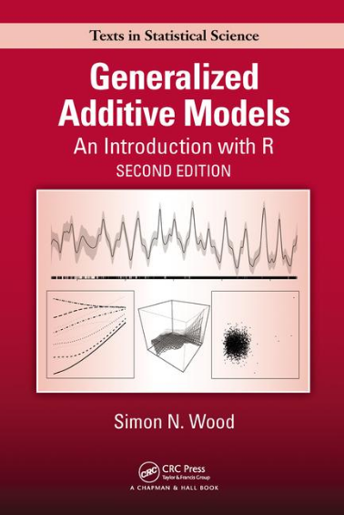

% Grupo de estudos em modelos de regressão flexíveis

O grupo de estudos em modelos flexíveis de regressão ([GEMFR][gemfr]) é
um grupo com interesse em modelos de regressão flexíveis tais como:
Generalized Additive Models (GAM); Generalized Additive Mixed (GAMM); e
ModelsGeneralized Additive Models for Location, Scale and Shape
(GAMLSS). O GEMFR é organizado por discentes e docentes do Programa de
Pós-Graduação em Estatística e Experimentação Agronômica
([PPGEEA][ppgeea]) do departamento de Ciências Exatas ([LCE][lce]) da
Escola Superior de Agricultura “Luiz de Queiroz” [ESALQ-USP][esalq].

Nesse semestre (_fall 2017_) o grupo se reúne todas as sextas-feiras das
14h00 às 16h00 na sala 311 do pavilhão de Engenharia da ESALQ para
discutir tópicos definidos em reunião anterior. Em
[Programa][./program.html] são registrados os históricos das reunião e o
planejamento das demais.

O GEMFR têm como principais gerais:

1. Compreender a teoria que fundamenta os métodos de regressão
   flexíveis: GAM, GAMM e GAMLSS; e
2. Compreender as saídas de _softwares_ que se propõe a ajustar esses
   tipos de modelos, incialmente trabalhar-se-á com os _softwares_
   [R][r] e [SAS][sas].

Os produtos ou serviços idealizados como fruto desse grupo de estudo
são:

1. Seminário sobre modelos flexíveis de regressão, a ser ministrado aos
   alunos do PPGEEA da ESALQ e aberto ao público geral. As atividades
   relacionadas ao seminário são:
    * Elaboração de slides com referencial teórico;
    * Elaboração de tutoriais aplicados ilustrando o uso de _softwares_
      e interpretação dos resultados.
2. Apostila sobre modelos flexíveis de regressão, a ser disponibilizada
   ao público geral; e
3. Artigo científico com aplicações e comparações dos modelos flexíveis
   de regressão a ser publicado em periódico da área de Estatística.

Alguns dos principais livros de referência sobre os temas estudados no
GEMFR são apresentados abaixo.

<style>
.myref {
    width: 20%;
    float: left;
    text-align: center;
    margin-top: 10px;
    display: inline;
}
.myref > p > a > img {
    box-shadow: 0px 1px 15px 1px black;
}
</style>

<div class="myref">
  <a href="http://staff.pubhealth.ku.dk/~pd/ISwR.html" target="_blank">
    
  </a>
</div>

<div class="myref">
  <a href="http://www.springer.com/la/book/9780387759357" target="_blank">
    
  </a>
</div>

<div class="myref">
  <a href="https://www.nostarch.com/artofr.htm" target="_blank">
    
  </a>
</div>

<div class="myref">
  <a href="http://www.leg.ufpr.br/~paulojus/embrapa/Rembrapa/Rembrapa.pdf" target="_blank">
    
  </a>
</div>

<div class="myref">
  <a href="http://www.lepem.ufc.br/jaa/RparaCS.php" target="_blank">
    
  </a>
</div>
<div style="display: -webkit-inline-box;">
</div>


```{r, results="asis", echo=FALSE}

cat(paste0(
    "<div id='update-message'>",
    format(Sys.time(),
           format = "Atualizado em %d de %B de %Y."),
    "</div>"),
    sep = "\n")

```

<!--------------------------------------------- -->
<!-- links -->
[gemfr]: https://jreduardo.github.io/grupo-esalq/
[ppgeea]: http://www.esalq.usp.br/pg/programas/estatistica/
[lce]: http://www.lce.esalq.usp.br/
[esalq]: http://www.esalq.usp.br/
[r]: https://www.r-project.org/
[sas]: https://www.sas.com
